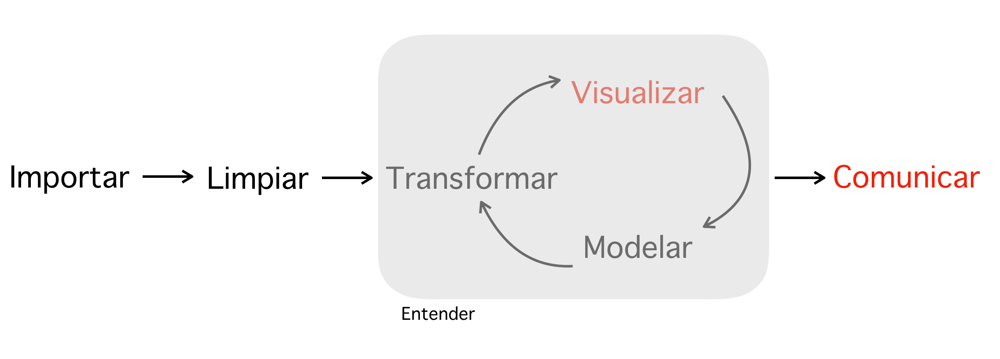

```{r setup, include=FALSE}
knitr::opts_chunk$set(echo = TRUE)
Sys.setlocale(locale = "es_ES.UTF-8")

pqkgs <- c("rio", "magrittr", "stringr", "dplyr", "plyr",  "repmis", "knitr", "rgdal", 
           "highcharter", "geojsonio", "spdplyr", "rmapshaper", "kableExtra", "knitr", "tidyverse", "ggplot2", "nycflights13")

lapply(pqkgs, function(x) require(x, character.only = TRUE))

#Citación automática
repmis::LoadandCite(pqkgs, file = 'packages.bib')
rm(pqkgs)

```

## Introducción

El curso introduce al participante a la visualización de datos en cuatro pasos. El  primero consiste en mostrar y hacer familiar las **herramientas para el procesamiento y visualización de datos**, Excel, R[-@CiteR],  [Tableau](https://www.tableau.com), [Plotly](https://plot.ly), entre otros. El segundo paso explora las características de la materia prima de toda visualización: **base datos limpia**. Este paso también explica **conceptos de estadística** útiles en visualizaciones: histogramas, boxplots, regresión lineal, etc. El tercer paso consiste en mostrar **tipos de visualizaciones**, estáticas, dinámicas y aplicaciones y **emplear lo aprendido** construyendo visualizaciones propias. Finalmente, el cuarto paso **resume lo aprendido** y **muestra una galería de visualizaciones**.

En resumen, los cuatro bloques son:

1. Herramientas para procesamiento y visualización
2. Bases de datos y estadística
3. Tipos de visualizaciones y aplicación práctica
4. Resumen y galería de visualizaciones

## Lógica del curso

Hadley Whickham [-@wickham2016r] resume el proceso de análisis de datos en la siguiente figura:



Visulizar y comunicar (usando visualizaciones) son parte de un circuito mayor. Por tanto, es importante al menos, explorar las características de cada eslabón y enfatizar en *visualizar* y *comunicar*. El curso cubre introductoriamente cada una de las partes de la figura. 

Visualizar para **entender** relaciones iniciales de los datos es un primer paso. Por ejemplo, el siguiente gráfico indaga la relación entre el número de vuelos y promedio de atraso en la llegada de más de 300 mil de estos que partieron del aeropuerto de Nueva York en 2013. Whickham [-@R-nycflights13] Highcharter[-@R-highcharter]

```{r, include=T, echo=F, warning=FALSE}
library(magrittr)
library(ggpomological)

not_cancelled <- flights %>% 
  filter(!is.na(dep_delay), !is.na(arr_delay))

delays <- not_cancelled %>% 
  group_by(tailnum) %>% 
  dplyr::summarise(
    delay = mean(arr_delay, na.rm = TRUE),
    n = n()
  )

ggplot(data = delays, mapping = aes(x = n, y = delay)) + 
  geom_point(alpha = 1/10) + 
  theme_pomological_fancy(base_family = "Homemade Apple") + 
  ylab("promedio de atraso minutos")
```


**Como se observa: A más vuelos menos variación en los atrasos**

La otra contribución de la visualización es mostrar resultados, narrar una historia. Por ejemplo, la siguiente animación muestra en menos de 10 segundos el incremento de muertes por sobredosis de droga en Estados Unidos en un periodo de 12 años.[@kunst] 

```{r, include=T, echo=F, warning=FALSE}
URL <- "http://graphics8.nytimes.com/newsgraphics/2016/01/15/drug-deaths/c23ba79c9c9599a103a8d60e2329be1a9b7d6994/data.json"

data <-  jsonlite::fromJSON(URL) %>% 
  tbl_df() %>% 
  gather(year, value, -fips) %>% 
  mutate(year = sub("^y", "", year),
         value = ifelse(is.na(value), 0, value))

ds <- data %>% 
  group_by(fips) %>% 
  do(item = list(
    fips = first(.$fips),
    sequence = .$value,
    value = first(.$value))) %>% 
  .$item

hc <- highchart(type = "map") %>% 
  hc_add_series(data = ds,
                name = "muertes por 100,000 personas",
                mapData = uscountygeojson,
                joinBy = "fips",
                borderWidth = 0.01) %>% 
  hc_colorAxis(stops = color_stops()) %>%  
  hc_title(text = "Como las muertes por sobredosis se incrementan en Estados Unidos") %>% 
  hc_legend(layout = "vertical", reversed = TRUE,
            floating = TRUE, align = "right") %>% 
  hc_add_theme(hc_theme_smpl()) %>% 
  hc_motion(
    enabled = TRUE,
    axisLabel = "year",
    labels = sort(unique(data$year)),
    series = 0,
    updateIterval = 50,
    magnet = list(
      round = "floor",
      step = 0.1
    )
  )
```

```{r, include=T, echo=F, warning=FALSE}
hc
```

<br>
<br>
<br>
¿Cómo llegar a producir visualizaciones similares? Solo si se sabe como utilizar cada eslabón del análisis de datos:

- Conocer las herramientas
- Conocer como manejar bases de datos
- Conocer algo de estadística
- Ser creativo


## Requerimientos

- Tener presintalados y/o conocer el acceso web de los programas que se utilizarán en una computadora portátil o estacionaria:
    + [R](https://cran.r-project.org)
    + [RStudio](https://www.rstudio.com)
    + [Tableau](https://www.tableau.com/es-es)
    + [Microsoft Excel](https://office.live.com/start/Excel.aspx?omkt=es-ES)

## Carga horaria

- 16 horas
    + 8 Horas Presenciales:4 sesiones de 2 horas cada una
    + 8 horas Virtuales: trabajo en proyectos finales

## Presupuesto

------o--------
------o--------

## Esquema del curso presencial

```{r, include=T, echo=F, warning=FALSE}
a <- tribble(
  ~Paso, ~`Contenidos mínimos`, ~Metodología, ~Horas,
  "Herramientas para procesamiento y visualización", "1. Conocer las características de procesadores de datos como R, Excel, Stata 2. Conocer la potencia de lenguajes de programación para fines estadísticos 3. Conocer el alcance de la reproducibilidad en trabajos cuantitativos. 4. Conocer a donde ir en la web a la hora de hacer visualizaciones", "1. Antes de la clase se distribuirán manuales de instalación para los programas que así lo requieran. 2. Se hará una demostración de todas las herramientas y ejemplos mínimos de cada uno de ellos. 3. Se proporcionaran bases de datos para la práctica", "2 horas, 120 minutos",
  "Bases de datos y estadística", "1. Conocer cuando una base de datos se considera limpia. 2. Conocer como limpiar una base de datos. 3. Conocer los formatos horizontal y vertical de bases de datos. 4. Conocer medidas de centralidad estadística. 5. Conocer medidas de dispersión estadística. 6. Bases de regresión lineal", "1. Ejercicios sobre centralidad y dispersion. 2. Detección de tendencias sobre centralidad y dispersión visualmente. 3. Detección de tendencias y relación de dos variables visualmente", "2 horas, 120 minutos", 
  "Tipos de visualizaciones y aplicación práctica", "1. Visualizaciones estáticas. 2. Visualizaciones dinámicas. 3. Visualización geográfica. 4. Animaciones. 5. Apps", "1. Muestra de cada tipo de visualización. 2. Ejercicios con bases de datos proporcionadas", "3 horas, 180 minutos",
  "Resumen y galería de visualizaciones", "1. Resumen general. 2. Preguntas y respuestas", "Discusión abierta", "1 hora, 60 minutos"
  )
```

```{r, include=T, echo=F, warning=FALSE}
library(kableExtra)
a %>% 
  kable("html") %>%
  kable_styling()
```

## Esquema del curso en su fase virtual

El objetivo de esta etapa es que los participantes, con todo lo aprendido, puedan desarrollar un proyecto personal de visualización que narre una historia.

En esta etapa el apoyo mío será virtual, acompañando las dudas y/o brindando sugerencias sobre el trabajo. Para este fin en la última clase presencial se darán a conocer acceso a bases de datos libres, a modo de incentivo.

La duración aproximada de esta etapa es de 8 horas a desarrollarse en el plazo de una semana, posterior a la conclusión de la fase presencial.

## Referencias de librerías 

Esta propuesta utilizó R y las librerías ggplot2[@R-ggplot2], magrittr[@R-magrittr] y dplyr[@R-dplyr]

## Referencias y material bibliográfico

